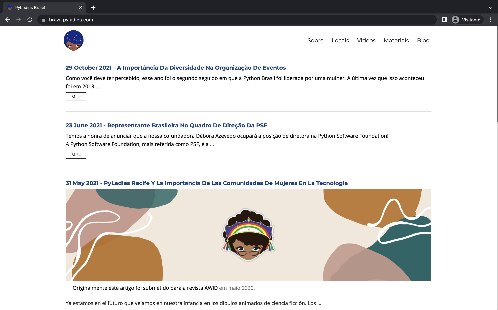
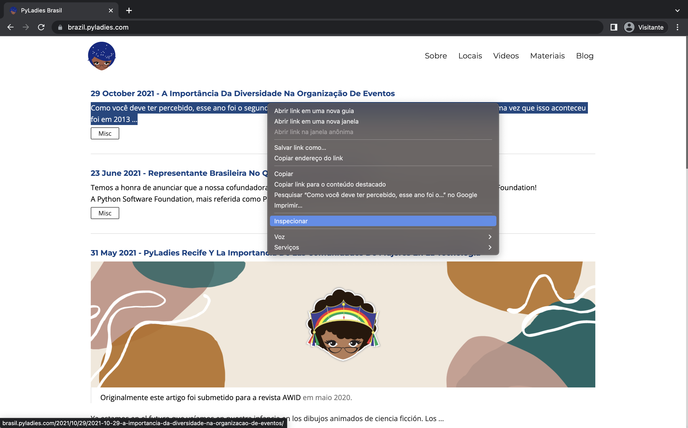
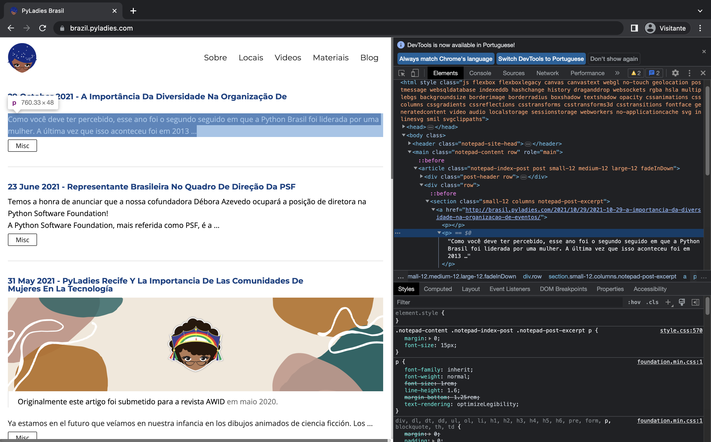

# crawler-tutorial
Tutorial de raspagem de dados realizado em parceria com o [JusBrasil](https://www.jusbrasil.com.br/) e o [PyLadies Salvador](https://www.instagram.com/pyladies.ssa/)

Nesse tutorial ensinamos a utilizar [`requests`](https://docs.python-requests.org/en/latest/) e [`BeautifulSoup`](https://beautiful-soup-4.readthedocs.io/en/latest/) para raspar as 20 primeiras vagas da página de [pesquisa do LinkedIn](https://www.linkedin.com/jobs/search).

> Esse tutorial foi baseado no blog post [How to build a scraping tool for Linkedin in 7 minutes](https://blog.devgenius.io/how-to-build-a-scraping-tool-for-linkedin-in-7-minutes-tool-data-science-csv-selenium-beautifulsoup-python-a673f12ac579)


## Índice

1. [Seja muito bem vinda!](#seja-muito-bem-vinda)
2. [Conceitos introdutórios](#conceitos-introdutórios)
    - [O que é um crawler?](#o-que-é-um-crawler)
    - [Bibliotecas](#bibliotecas)
        - [requests](#requests)
        - [BeautifulSoup](#beautifulsoup)
    - [Como uma página web é construída](#como-uma-página-web-é-construída)
        - [HTML](#html)
        - [CSS](#css)
3. [Instalando as bibliotecas](#instalando-as-bibliotecas)
    - [Ambiente virtual](#ambiente-virtual)
        - [O que é um ambiente virtual?](#o-que-é-um-ambiente-virtual)
        - [Criando um ambiente virtual](#criando-um-ambiente-virtual)
4. [Executando o crawler](#executando-o-crawler)
5. [Explicação detalhada do crawler](#explicação-detalhada-do-crawler)
6. [Material de referência](#material-de-referência)

## Seja muito bem vinda!
Se você chegou até aqui, significa que você já consegue entender conceitos básicos de programação e desenvolvimento de algoritmos *(caso queira revisar alguns conceitos de programação veja os [materiais de referência](#material-de-referência))* e está pronta para entrar no universo dos crawlers, descobrir o que são, como funcionam e desenvolver seu próprio crawler. 
**E aí? Preparada?**

## Conceitos introdutórios
### O que é um crawler?


Quando estamos navegando em algum site, preenchendo um formulário ou realizando algum pesquisa, é bem comum nos depararmos com páginas que nos pedem para identificar caracteres em uma imagem, selecionar imagens que contenham algo específico ou marcar um checkbox e confirmar que “Eu não sou um robô". Bom, podemos dizer que parte disso existe por causa dos crawlers!


Um web crawler, também conhecido como robô, é um algoritmo que acessa sites na internet de forma automatizada e através da análise do seu código fonte, varre suas páginas em busca de colher dados contidos nelas para classificá-los e/ou armazená-los, usando-os para diferentes propósitos. Alguns desses propósitos são:
- Motores de busca
- Monitoramento de marcas ou temas em portais de notícias
- Construção de base de dados offline para processamento de dados

Para se desenvolver um crawler, contamos com diversas ferramentas que dão suporte a construção desses algoritmos sem a necessidade de milhares de linhas de códigos feitas a mão por nós. Entre elas temos as bibliotecas específicas para isso.

### Bibliotecas
Imagina que você precisa fazer um bolo. Você tem os ingredientes, você sabe os passos da receita e você irá segui-los. Imagina quão difícil seria se você precisasse fazer a farinha, a manteiga, o açúcar, colher o leite, criar a galinha e esperar vir o ovo… seria difícil, não? Ainda bem que alguém já fez isso por nós e pegamos os ingredientes prontinhos no supermercado.

É exatamente assim que são as bibliotecas! Uma biblioteca basicamente é uma coleção de algoritmos já prontos que podem ser reutilizados diversas vezes sem você precisar desenvolver tudo novamente.

Se você está programando em Python e, em determinado momento, você precisa escolher aleatoriamente um valor entre números, letras ou qualquer outra lista de valores, podemos usar a biblioteca random para isso, por exemplo:
```
>>> import random
>>> numero_sorteado = random.randint(0, 1000) # Sorteia um número entre 0 e 1000
>>> numero_sorteado
466
>>> vogal_sorteada = random.choice("aeiou") # Sorteia uma letra de acordo com a string passada
>>> vogal_sorteada
'i'
```

Viu como o uso de bibliotecas torna a vida da pessoa programadora mais fácil? Então vamos agora entender um pouco mais sobre as duas principais bibliotecas que usaremos no nosso código: `requests` e `BeautifulSoup`.

#### *requests*
A biblioteca requests é utilizada para a realizarmos solicitações via protocolo HTTP a páginas da internet utilizando Python. Com ela é possível receber todo um conteúdo de uma página, preencher um formulário de cadastro e até apagar informações. Por exemplo, vamos fazer uma requisição ao [site do Google](http://google.com):

```
>>> import requests
>>> response = requests.get("http://google.com") # Realiza uma solicitação ao site do google
>>> response
<Response [200]>
>>> response.content # Conteúdo do site
b'<!doctype html><html itemscope="" itemtype="http://schema.org/WebPage" lang="pt-BR"> [CONTEÚDO DO SITE AQUI] </html>'
```

Para saber mais informações sobre a biblioteca requests, você pode consultar a [documentação oficial](https://docs.python-requests.org/en/latest/index.html).

#### *BeautifulSoup*
BeautifulSou (bs4) é uma biblioteca bastante utilizada quando queremos extrair dados existentes em arquivos do tipo XML ou HTML (que é o tipo mais comum utilizado nas páginas web).

Como você deve ter percebido no tópico anterior, o conteúdo de uma página web HTML pode ser muito extenso e com uma variedade de palavras e termos confusos que podem ser encontrados mais de uma vez e, talvez, encontrar o que você procura pode se tornar trabalhoso. Com o apoio do BeautifulSoup isso pode ser mais fácil, sendo possível encontrar elementos específicos no código, como o titulo da página (soup.title) ou o corpo (soup.body), além de elementos nome da tag (.name) e a tag parent (.parent.name) ou buscas específicas usando o método `find`.

"tag", "body", "title"... Podem ser nomes confusos para você né? Não se preocupe! No próximo tópico, você irá entender melhor como são construídas as páginas da web e tudo isso ficará mais claro.

Curtiu? Você pode pesquisar mais sobre a biblioteca BeautifulSoup e suas diversas funcionalidades consultando a [documentação oficial](https://beautiful-soup-4.readthedocs.io/en/latest/).


### Como uma página web é construída
Para entendermos um pouco sobre como uma página web é contruída, vamos acessar o [site da comunidade PyLadies Brasil](https://brazil.pyladies.com/) em seu navegador. Ao acessar, você provavelmente vai encontrar algo parecido com a imagem a seguir:


Esse é o site oficial da comunidade PyLadies no Brasil! Aqui você irá encontrar informações de todas as comunidades PyLadies no Brasil, inclusive Salvador!

Agora, que tal tentarmos entender como essa página é estruturada? Para isso, vamos utilizar um recurso do navegador chamado **inspecionar elemento**, para acessá-lo, basta aperta o botão F12 ou clicar com o botão direito do seu mouse, procurar pelo nome "Inspecionar" ou "Inspecionar elemento" e clicar em cima com o botão esquerdo.


Feito isso, você irá encontrar uma nova seção abaixo ou na lateral da sua página, como na imagem abaixo. Nessa seção, você irá encontrar todo o código escrito no arquivo HTML responsável pelo conteúdo da página, além de informações de estilo e elementos CSS utilizados para deixar a página mais bonita. 



Vamos entender mais sobre isso?


#### HTML
HTML é um tipo de código interpretado pelo navegador para que uma página web seja exibida. A sigla HTML significa "HyperText Markup Language". HiperText significa que é um tipo de texto que suporta hiperlinks entre páginas. Markup (marcação) vem do ato de marcar um documento com códigos que dizem para o navegador web como a interpretar a página. Language é de linguagem, um código. Sendo assim, podemos traduzir literalmente HTML como Linguagem de Marcação de HiperTexto.

Os códigos das páginas em HTML são estruturados a partir de tags, que representam os elementos de marcação, cada tag começa com < e termina com >.

A tag mais básica é a `<html>`, todo o conteúdo da página está entre tag de início `<html>` e a tag de fim `</html>`, sendo assim, ela estará sempre no começo do arquivo.

Além disso, cada página HTML também é dividida em dois elementos: head (cabeçalho) e body (corpo).
A tag `<head>` é utilizada para dizer ao navegador quais são as configurações da página. Dentro dela, encontramos as informações que não são exibidas na tela.
Já a tag `<body>` diz ao navegador qual é o conteúdo de fato da página. Nela se encontra tudo o que se quer que apareça na página web.
Para se construir esse conteúdo de fato, contamos com outras tags que possuem uso específico:
- `<p>` para parágrafos
- `<a>` para links
- `<h1> <h2> <h3> <h4>` e `<h5>` para textos em tamanhos diferentes

e muitas outras que você pode [encontrar aqui](https://developer.mozilla.org/en-US/docs/Web/HTML/Element).

#### CSS
CSS é a sigla para "Cascading Style Sheets", que em português quer dizer "Folhas de Estilo em Cascata". É uma linguagem de estilo comumente utilizada para a formatação e o visual de uma página web (ou de todo um site) que foi escrita em uma linguagem de marcação, como HTML. Podemos dizer que é a responsável por toda a beleza e estética do site, desde a cores dos textos, fundo, estilo da fonte, animações e diversas outras coisas.

Para aplicar essas regras de estilo, os arquivos de CSS tem como referência as próprias tags ou elementos delas. São os mais comuns: `id` e `class`.

Curtiu? Você pode saber mais sobre CSS [aqui](https://developer.mozilla.org/en-US/docs/Web/CSS).


#### **_Desafio_:** 
**Acesse a página do twitter das PyLadies Brasil (https://twitter.com/PyLadiesBrasil), inspencione-a e tente alterar o condteúdo do primeiro tweet não fixado para a seguinte frase: _"Estou aprendendo um pouco sobre HTML no tutorial de crawler"_.**

Agora que entendemos o que é um crawler, as bibliotecas que utilizaremos para desenvolver um e como uma página web é construída, temos a base para seguir e colocar a mão na massa no desenvolvimento do nosso próprio crawler!


## Instalando as bibliotecas

### Ambiente virtual
#### O que é um ambiente virtual?
No mundo do desenvolvimento, principalmente com Python, é comum trabalharmos ao mesmo tempo com diversos projetos. Geralmente cada um desses projetos trabalha com bibliotecas diferentes. Dessa forma, pensando em isolar cada um desses projetos e suas bibliotecas, criamos **ambientes virtuais**. 

Caso você queira saber mais sobre esse conceito/ferramenta, compilamos alguns materiais que podem ser úteis para você:
* [Para que serve um ambiente virtual Python e como criá-lo](https://medium.com/programacaodinamica/para-que-serve-um-ambiente-virtual-python-e-como-cri%C3%A1-lo-b4217ffed8d7#:~:text=Um%20ambiente%20virtual%20%C3%A9%20uma,facilmente%20apenas%20excluindo%20a%20pasta.)
* [Ambientes virtuais e instalação de bibliotecas - Live de Python #191](https://www.youtube.com/watch?v=naGF7EIUFp0)
* [Ambientes Virtuais, o que são e para que servem?](https://www.youtube.com/watch?v=abTLJtSjclg)
* [Documentação da biblioteca `venv`](https://docs.python.org/pt-br/3/library/venv.html)

#### Criando um ambiente virtual

Agora que sabemos o que é um ambiente virtual, vamos criar um para poder executar o nosso crawler.

1. Abra o terminal no seu computador, e nele entre na pasta desse projeto:

    ```bash
    cd crawler-tutorial/
    ```

    > Dependendo da onde você baixou esse projeto, o caminho para acessar a pasta pode mudar. Para saber mais sobre o comando `cd`, acesse [aqui](https://pt.wikipedia.org/wiki/Cd_(comando)).

    Para saber se estamos realmente dentro da pasta correta, você pode executar o comando `ls` (mais informações, [aqui](https://pt.wikipedia.org/wiki/Ls)) no terminal, ele deverá mostrar os arquivos que existem nesse projeto.

2. Crie o ambiente virtual utilizando a biblioteca [`venv`](https://docs.python.org/3/library/venv.html) do Python. Onde, `crawler-venv` será o nome do ambiente virtual.

    ```bash
    python3 -m venv crawler-env
    ```

3. Ative o ambiente virtual, caso ele ainda não tenha sido ativado.

    * *No linux:*
    
    ```bash
    source crawler-env/bin/activate
    ```

    * *No Windows:*

    ```bash
    crawler-env\Scripts\activate.bat
    ```


4. Instale as bibliotecas que iremos utilizar nesse projeto (com o ambiente virtual ativado). Essas bibliotecas e as suas respectivas versões estão definidas no arquivo `requirements.txt`. No Python, para instalar bibliotecas a partir desse arquivo, executamos o comando:

    ```bash
    pip install -r requirements.txt
    ```

**PRONTO!** :tada: :confetti_ball: Conseguimos criar o nosso ambiente virtual e instalar as bibliotecas que vamos utilizar nesse projeto!  

> Para desativar o ambiente virtual, execute: `deactivate`.

## Executando o crawler

Depois de ter criando o ambiente virtual e instalando as bibliotecas, ative o ambiente virtual (caso ele não esteja ativo):

* *No linux:*

```bash
source crawler-env/bin/activate
```

* *No Windows:*

```bash
crawler-env\Scripts\activate.bat
```

E execute o crawler que foi desenvolvido:

```bash
python crawler.py
```

## Explicação detalhada do crawler

Caso você queira entender mais a fundo esse crawler e ter acesso a muito mais material de referência, abra no seu navegador o arquivo `crawler_explicacao.html`. 

Você também pode brincar com esse material. Para isso recomendamos você utilizar o [Jupyter](https://jupyter.org/), mais especificamente o `JupyterLab`. Sendo assim, em seu terminal execute:

```bash
jupyter-lab
```

TARÁM! Será aberto em seu navegador uma janelinha mais ou menos que nem essa:


Dentro do JupyterLab você pode abrir o arquivo `crawler_explicacao.ipynb` e brincar com o crawler. 

Boas raspagens!


## Material de referência
- [Tutorial de Python - PyLadies Rio](https://github.com/PyLadiesRio/workshop-python01)
- [Introdução a Python PyLadies Brasil](https://introducao-a-python-pyladies-brasil.netlify.app/)
